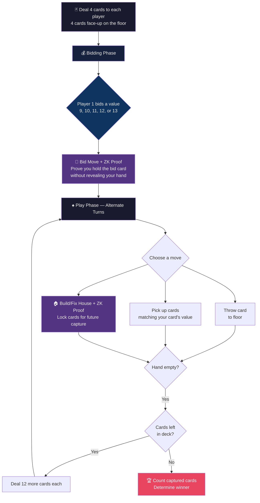
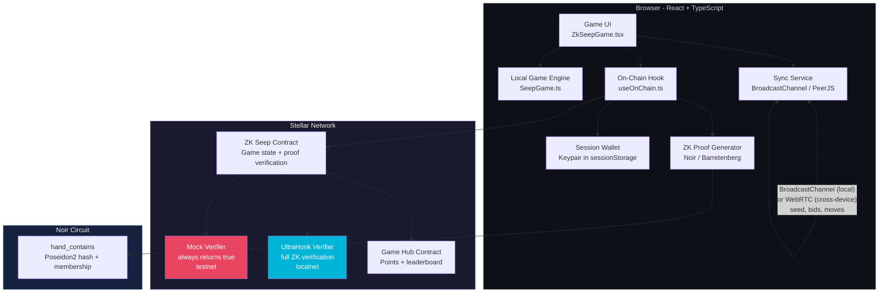
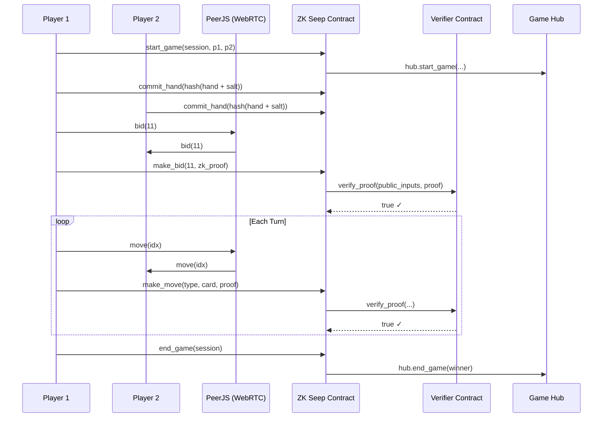

# 🃏 ZK Seep - Zero-Knowledge Card Game on Stellar

> *Bringing South Asia's most popular card game to blockchain, with zero-knowledge proofs to eliminate the cheating that plagues existing platforms.*

**[🎮 Play Live](https://zk-seep.vercel.app)** · **[📜 Contract on Testnet](https://stellar.expert/explorer/testnet/contract/CBMD4JH436B663IZAQLX5RHNYICU4COZQIXOOLWQU6HVM2W555CGNCDM)**

---


## The Problem

**Seep** (also called *Sweep*) is a trick-taking card game played by **100M+ people** across India, Pakistan, and the South Asian diaspora. On Google Play, Seep apps have **100,000+ downloads** - but dig into the reviews and you'll find a recurring theme:

> ⭐ *"The bot always knows my cards"*
> ⭐ *"They bid 13 without even having a King"*
> ⭐ *"Rigged - the AI cheats every single time"*

The core problem is **information asymmetry**. In physical Seep, you trust that your opponent can't see your hand. In digital Seep, the server sees everything. Bots exploit this by:

- **Bidding cards they don't hold** - a player bids 13 (King) when they have no King, but they know *you* don't have one either
- **Building houses on phantom cards** - creating a house of value 11 when they don't hold a Jack, knowing the remaining Jacks are buried in the deck
- **Perfect information play** - the server-side AI sees both hands and the deck order, making optimal plays that are statistically impossible for a fair player

**ZK Seep solves this.** By enforcing zero-knowledge proofs on-chain, every bid and every house-building move cryptographically proves the player holds the card they claim - without revealing what else is in their hand.

---

## How ZK Proofs Fix Cheating

In Seep, there are two critical moments where a player claims to hold a specific card:

1. **Bidding** - "I bid 11" means "I have a Jack (value ≥ 9) in my hand"
2. **House building** - "I build a house of value 12" means "I have a Queen in my hand to claim it later"

Without ZK proofs, the server (or opponent in P2P) must trust these claims blindly. With ZK proofs:

```
┌─────────────────────────────────────────────────────┐
│                   ZK Proof Circuit                  │
│                                                     │
│  Private inputs:  hand[] (12 card values), salt     │
│  Public inputs:   hand_hash, target_value           │
│                                                     │
│  Constraints:                                       │
│  1. Poseidon2(hand ++ salt) == hand_hash            │
│  2. ∃ i : hand[i] == target_value                   │
│                                                     │
│  Result: Proof that target_value ∈ hand             │
│          without revealing hand contents            │
└─────────────────────────────────────────────────────┘
```

The player commits a **Poseidon2 hash** of their hand at the start of the game. For every bid and house move, they generate a ZK proof showing "my hand contains a card of this value" - verified against the committed hash. **No one - not the opponent, not the server, not the blockchain - ever sees the actual hand.**

---

## What is Seep?

Seep is a 2-player card game using a standard 52-card deck. The objective is to capture cards from the floor and score points.

> 📖 **Want the full deep-dive?** Check out **[SeepRules.md](./SeepRules.md)** for exhaustive rules, advanced strategy tips (card memorization, the "last Jack" power play, Seep prevention), worked examples from real game situations, and common mistakes to avoid.

### Card Values & Scoring

| Cards | Game Value | Score |
|---|---|---|
| A (Ace) | 1 | 1 point each |
| 2–10 | Face value | Spades: face value; 10♦: 6 pts |
| J (Jack) | 11 | Spades only: 11 pts |
| Q (Queen) | 12 | Spades only: 12 pts |
| K (King) | 13 | Spades only: 13 pts |

**Total points in the deck: 100.** A standard win requires capturing more than your opponent.

### Game Flow



### The 7 Move Types

On each turn, a player plays one card from their hand. Depending on the floor state, they can:

| # | Move | Description | ZK Proof? |
|---|---|---|---|
| 1 | **Throw** | Place card on floor as a new loose pile | No |
| 2 | **Build House** | Card + loose piles → unfixed house (value 9–13) | 🔐 Yes |
| 3 | **Cement** | Card matches unfixed house → fix it | 🔐 Yes |
| 4 | **Merge + Fix** | Card + loose piles merge with unfixed house → fixed | 🔐 Yes |
| 5 | **Add to Fixed** | Card + loose piles → add to existing fixed house | 🔐 Yes |
| 6 | **Direct Fix** | Card directly onto fixed house of same value | 🔐 Yes |
| 7 | **Pick Up** | Card value matches pile/combo sum → capture all | No |

**Houses** are piles worth 9–13 that "lock" cards on the floor. Building a house of value X means you're reserving those cards to pick up later with a card of value X. The ZK proof ensures you actually *have* that card.

### Seep Bonus

If you capture **every card on the floor** in a single pickup, that's a **Seep** - worth bonus points equal to the bid value. But three Seeps in one game cancels all your Seep bonuses!

---

## Architecture



### Component Breakdown

| Component | Purpose |
|---|---|
| **ZK Seep Contract** (`contracts/zk-seep`) | On-chain game state, turn validation, ZK proof verification via external verifier |
| **Mock Verifier** (`contracts/mock-verifier`) | Always returns `true` - used on testnet where UltraHonk exceeds the 400M CPU instruction cap |
| **Game Hub** | Official testnet Game Hub — points tracking and leaderboard across all games in the Stellar Game Studio |
| **Noir Circuit** (`circuits/hand_contains`) | Poseidon2 hash commitment + card membership proof |
| **Game Engine** (`src/game/`) | Full Seep rule engine in TypeScript - move generation, validation, scoring |
| **Sync Service** | Dual-mode: BroadcastChannel (localhost) or PeerJS WebRTC (deployed/cross-device) |
| **Session Wallet** | Ephemeral Stellar keypair per tab - signs game transactions silently without wallet popups |
| **On-Chain Hook** | Fires `start_game`, `make_bid`, `make_move`, `end_game` to the contract during gameplay |

---

## Transaction Flow



---

## The ZK Circuit

The `hand_contains` circuit is written in **Noir** (pinned to Nargo 1.0.0-beta.9, bb 0.87.0):

```noir
fn main(
    hand: [Field; 12],        // private: card values (1-13, 0 = empty)
    salt: Field,              // private: random nonce
    hand_hash: pub Field,     // public: Poseidon2 commitment
    target_value: pub Field,  // public: claimed card value
) {
    // 1. Verify commitment: hash(hand ++ salt) == hand_hash
    let mut preimage: [Field; 13] = [0; 13];
    for i in 0..12 { preimage[i] = hand[i]; }
    preimage[12] = salt;
    assert(Poseidon2::hash(preimage, 13) == hand_hash);

    // 2. Prove possession: ∃ i : hand[i] == target_value
    let mut found = false;
    for i in 0..12 {
        if hand[i] == target_value { found = true; }
    }
    assert(found, "Target value not found in hand");
}
```

**Why Poseidon2?** It's a ZK-friendly hash function - ~100x cheaper to prove inside a circuit compared to SHA-256 or Keccak.

---

## On-Chain vs. Local Verification

| Environment | Verifier | CPU Instructions | Status |
|---|---|---|---|
| **Testnet** | Mock Verifier (always `true`) | ~300K | ✅ Deployed |
| **Localnet** (`--limits unlimited`) | Real UltraHonk Verifier | ~367M | ✅ Works |
| **Mainnet** | Real Verifier | Needs 400M+ cap | ⏳ Waiting for limit increase |

The Stellar testnet currently has a **400M CPU instruction cap** per transaction. UltraHonk proof verification requires ~367M instructions for even a basic proof - dangerously close to the limit. Per hackathon organizer guidance, **local deployment with `--limits unlimited` is accepted** for evaluation.

The mock verifier allows us to demonstrate the full transaction flow on testnet while the real verifier runs on localnet.

---

## Embedded Session Wallet

Traditional blockchain games require users to approve every transaction via their browser wallet (Freighter, MetaMask, etc.). In a card game with 20+ moves per match, this is unplayable.

ZK Seep uses an **embedded session wallet**:

1. Player connects Freighter (one-time)
2. An ephemeral `Keypair` is generated and stored in `sessionStorage`
3. Player funds the session wallet with XLM (one Freighter approval)
4. All in-game transactions (`commit_hand`, `make_bid`, `make_move`, `end_game`) are signed **silently** by the session wallet
5. When the browser tab closes, the session wallet is destroyed

This gives a **Web2-like gameplay experience** with full on-chain verifiability.

---

## Cross-Device Multiplayer

ZK Seep uses a **dual-mode networking layer** that auto-selects the best transport:

### Localnet (Same Computer)

On `localhost`, the app uses the browser-native **BroadcastChannel API** for instant, zero-latency communication between tabs. No network configuration required — messages are delivered in-process.

```
Tab 1 ←→ BroadcastChannel("zk-seep-{roomCode}") ←→ Tab 2
```

> **Note:** Open two normal browser tabs (not InPrivate/Incognito — `BroadcastChannel` doesn't bridge across browser contexts). Each tab automatically gets its own session wallet via `sessionStorage`.

### Testnet / Deployed (Cross-Device)

On deployed URLs (e.g., Vercel), the app switches to **PeerJS WebRTC** for direct browser-to-browser communication across devices and networks. To handle NAT traversal (essential when players are on mobile data, corporate WiFi, or behind firewalls), the app uses **Metered TURN relay servers**.

```
Browser A ←→ TURN Relay (global.relay.metered.ca) ←→ Browser B
```

The ICE configuration covers every network scenario:

| Protocol | Port | Use Case |
|----------|------|----------|
| STUN | 80 | NAT discovery |
| TURN UDP | 80 | Standard relay |
| TURN TCP | 80 | Corporate firewall fallback |
| TURN | 443 | HTTPS port (rarely blocked) |
| TURNS (TLS) | 443 | Maximum compatibility |

**TURN credentials** are stored as environment variables (not hardcoded):

```env
VITE_TURN_USERNAME=your_metered_username
VITE_TURN_CREDENTIAL=your_metered_credential
```

If TURN credentials are not set, the app falls back to STUN-only (works on most home networks but may fail on restrictive ones).

### How It Works

1. Player 1 creates a room → gets a room code
2. Player 2 enters the room code
3. Game seed, bids, and moves are exchanged directly between browsers
4. No central game server required — fully decentralized

Both players run the same deterministic game engine with the same seed. Move indices are exchanged, so both engines stay perfectly synchronized.

---

## Market Opportunity

### Why Seep on Stellar?

| Factor | Detail |
|---|---|
| **100M+ players** | Seep is the #1 card game in Punjab and widely played across South Asia |
| **Stellar's India push** | SDF is actively expanding in India - Seep brings a massive ready-made audience |
| **Cheating epidemic** | Every major Seep app on Play Store is plagued by cheating complaints |
| **ZK is the solution** | Zero-knowledge proofs make cheating mathematically impossible |
| **Low fees** | Stellar's ~0.00001 XLM tx fees make per-move on-chain verification viable |
| **Fast finality** | 5-second block times keep gameplay responsive |

### Competitive Landscape

| Platform | Cheating Protection | On-Chain | Cross-Device | ZK Proofs |
|---|---|---|---|---|
| Play Store Seep apps | ❌ None | ❌ | ❌ | ❌ |
| Existing blockchain games | ⚠️ Server-side | ⚠️ Partial | ✅ | ❌ |
| **ZK Seep** | ✅ **Cryptographic** | ✅ **Full** | ✅ | ✅ |

---

## Tech Stack

| Layer | Technology |
|---|---|
| Smart Contract | Rust + Soroban SDK |
| ZK Circuit | Noir (Nargo 1.0.0-beta.9) |
| Proof System | UltraHonk (bb 0.87.0) |
| Frontend | React 19 + TypeScript + Vite |
| Styling | TailwindCSS 4 |
| Multiplayer | BroadcastChannel (local) + PeerJS WebRTC (cross-device) |
| Wallet | Freighter (connect) + Session Keypair (gameplay) |
| Deployment | Vercel (frontend) + Stellar Testnet (contracts) |

---

## Deployed Contracts (Testnet)

| Contract | Address |
|---|---|
| ZK Seep | `CCTI7YU4VJKERNO6Y2UHKVV4WNHIPDNAHG5OXNAMAJUKL5ZQBSEJ3QDV` |
| Game Hub (official) | `CB4VZAT2U3UC6XFK3N23SKRF2NDCMP3QHJYMCHHFMZO7MRQO6DQ2EMYG` |
| Mock Verifier | `CC64CBJ5KCVCJX4PO4MQXHNFL6AGIQ2MDG6UIFGZ5NWSKN5D2ZIHVEIX` |

---

## Local Development

### Prerequisites

- [Rust](https://rustup.rs/) + `wasm32-unknown-unknown` target
- [Stellar CLI](https://developers.stellar.org/docs/tools/developer-tools)
- [Bun](https://bun.sh/) (or Node.js 18+)
- [Nargo 1.0.0-beta.9](https://noir-lang.org/) (for ZK circuits)

### Quick Start

```bash
# Clone and install
git clone https://github.com/user/ZK-Seep.git
cd ZK-Seep

# Build contracts
stellar contract build

# Deploy to testnet
bun run scripts/deploy.ts

# Start frontend
cd zk-seep-frontend
bun install
bun run dev
```

### Running with Real ZK Verification (Localnet)

The real UltraHonk ZK verifier requires ~367M CPU instructions — beyond the testnet 400M cap. Use localnet with unlimited limits to run the **full ZK pipeline**.

> **Note:** On localnet, the deploy script uses a **mock game hub** (since the official Game Hub only exists on testnet). The mock hub has the same interface but is deployed locally. The `VITE_MOCK_GAME_HUB_CONTRACT_ID` env var in `.env.local` reflects this.

#### Prerequisites

- [Docker](https://docs.docker.com/get-docker/) — for running the Stellar Quickstart node
- [Stellar CLI](https://developers.stellar.org/docs/tools/developer-tools) — `stellar` binary in your PATH
- [Rust](https://rustup.rs/) with `wasm32-unknown-unknown` target (`rustup target add wasm32-unknown-unknown`)
- [Bun](https://bun.sh/) (or Node.js 18+)

#### Step 1: Start the Stellar Localnet Node

```bash
docker run --rm -it -p 8000:8000 --name stellar \
  stellar/quickstart:soroban-dev --local --limits unlimited
```

Wait until you see `Horizon    : listening on port 8000` before proceeding.

#### Step 2: Configure Network & Fund Deployer

```bash
stellar network add localnet \
  --rpc-url "http://localhost:8000/soroban/rpc" \
  --network-passphrase "Standalone Network ; February 2017"

stellar keys generate alice --network localnet --fund
```

#### Step 3: Deploy All Contracts

The deploy script builds, deploys, and wires up all three contracts (`mock-game-hub`, `mock-verifier`, `zk-seep`) and writes the contract IDs to `.env.local`:

```bash
chmod +x scripts/deploy-localnet.sh
./scripts/deploy-localnet.sh
```

Expected output:
```
  mock-game-hub: C...
  mock-verifier: C...
  zk-seep:       C...
  ✅ .env.local updated
```

#### Step 4: Start the Frontend

```bash
cd zk-seep-frontend
bun install
bun run dev
```

#### Step 5: Play!

1. Open **two normal browser tabs** at `http://localhost:5173`
   - Do **not** use InPrivate/Incognito — `BroadcastChannel` doesn't bridge across browser contexts
2. Click **Create & Fund Game Wallet** in both tabs
   - Each tab gets its own session wallet via `sessionStorage` (no Freighter needed on localnet)
3. Player 1 clicks **Create Game** → copy the room code
4. Player 2 pastes the room code → clicks **Join Game**
5. Both players authorize the game on-chain (multi-sig handshake)
6. Play! House-building and bid moves generate real ZK proofs verified on-chain

---

## Project Structure

```
ZK-Seep/
├── contracts/
│   ├── zk-seep/              # Main game contract (Rust/Soroban)
│   │   └── src/lib.rs         # 689 lines - game state, turns, ZK verification
│   ├── mock-verifier/         # Always-true verifier for testnet
│   └── mock-game-hub/         # Points tracking contract
├── circuits/
│   ├── hand_contains/         # Noir circuit: prove card ∈ hand
│   └── no_high_cards/         # Noir circuit: prove no high cards
├── zk-seep-frontend/
│   ├── src/
│   │   ├── game/              # Full Seep engine (TypeScript)
│   │   │   ├── Game.ts        # Game lifecycle, dealing, rounds
│   │   │   ├── Player.ts      # Hand management, move generation
│   │   │   ├── Center.ts      # Floor state, house building
│   │   │   ├── Card.ts        # Card types, scoring
│   │   │   └── Move.ts        # 7 move types
│   │   ├── games/zk-seep/
│   │   │   ├── ZkSeepGame.tsx # Main game component (1050 lines)
│   │   │   ├── zkSeepService  # Contract interaction layer
│   │   │   └── components/    # UI components
│   │   ├── hooks/
│   │   │   ├── useWallet.ts   # Freighter + session wallet
│   │   │   └── useOnChain.ts  # Contract call hook
│   │   └── services/
│   │       └── peerService.ts # Dual-mode: BroadcastChannel / PeerJS
│   └── package.json
└── scripts/                   # Build, deploy, setup scripts
```

---

## What We Built

This is not a weekend hackathon project. ZK Seep includes:

- ✅ **Complete Seep game engine** — all 7 move types, house limits, seep bonuses, multi-round dealing
- ✅ **ZK circuit** — Noir circuit with Poseidon2 hash commitment + card membership proof
- ✅ **On-chain game contract** — 689 lines of Rust, full game lifecycle with ZK proof enforcement
- ✅ **Cross-device multiplayer** — dual BroadcastChannel / PeerJS WebRTC, no central server
- ✅ **Embedded session wallet** — zero popup fatigue, Web2-like UX
- ✅ **Async multi-sig handshake** — two session wallets authorize `start_game` across devices via XDR reconstruction
- ✅ **Mock verifier** — enables full testnet demo within CPU limits
- ✅ **Game Hub integration** — start_game / end_game for points and leaderboard
- ✅ **Beautiful UI** — dark theme, card animations, responsive design
- ✅ **Live deployment** — playable at [zk-seep.vercel.app](https://zk-seep.vercel.app)

---

## 🏗️ Key Engineering Feats

This project required solving hard, real-world distributed systems and cryptography problems:

| Challenge | What We Solved |
|---|---|
| **WebRTC ICE Negotiation** | Bypassing symmetric NATs and strict router firewalls with STUN/TURN relay fallback |
| **TURN Relay Routing** | Credentialed Metered TURN servers across UDP, TCP, and TLS for guaranteed P2P on any network |
| **Async Multi-Sig XDRs** | Cracking open, modifying `sourceAccount` + sequence numbers, and resealing Stellar transaction envelopes across devices |
| **Smart Contract VM Traps** | Navigating footprint drops, `require_auth` key mismatches, `toEnvelope()` immutability, and `len() == 0` proof safety checks |
| **RPC Race Conditions** | Managing sequence number increments against delayed ledger indexing with breathing delays |
| **Zero-Knowledge Proofs** | Browser-side Noir circuit compilation + UltraHonk proof generation, verified on-chain via Soroban cross-contract calls |
| **Session Wallet UX** | Ephemeral per-tab keypairs that sign silently — zero wallet popups during gameplay |

---

## Technical Deep Dive

### Async Multi-Signature Handshake

The `start_game` contract requires **both** players to `require_auth`, but they're on separate devices. Solving this required fixing four critical issues:

1. **Double-Simulation Footprint Drop** — Player 2 re-simulated the transaction locally, which dropped Player 1's nonce from the footprint. Fix: bypass standard submission and send the exact XDR footprint that Player 1 simulated.
2. **`toEnvelope()` Immutability Trap** — `tx.toEnvelope()` returns a *disconnected copy*. Injecting Player 1's signature into the envelope didn't propagate to the submitted transaction. Fix: export the modified envelope to Base64, then reconstruct via `TransactionBuilder.fromXDR()`.
3. **Source Account Mismatch** — The transaction's `sourceAccount` was Player 1's, but Player 2 signed the envelope. The network rejected it: `"signer does not belong to account"`. Fix: swap `sourceAccount` to Player 2 before signing, while preserving Player 1's auth inside the invoke op's `auth[]` array.
4. **Sequence Number Offset** — After swapping the source, the sequence number was still Player 1's. Stellar requires `current + 1`. Fix: fetch Player 2's live sequence number and inject `BigInt(seq) + 1n` into the XDR.

### Off-Chain Turn Enforcement

The on-chain contract does **not** enforce turn order — PeerJS delivers moves in ~50ms, but on-chain confirmations take ~5 seconds. Strict alternation would cause `NotYourTurn` race conditions.

**What the contract enforces:** player identity, ZK proof validation, game phase validity, score tracking.
**What the frontend enforces:** turn order, move legality, house rules.

### Session Wallet Identity (Localnet)

On localnet, the same Freighter wallet can be used for both players. Each browser tab generates its own **ephemeral session wallet** (`sessionStorage` is per-tab), so the contract sees two distinct players even when the same Freighter is connected.

---

<p align="center">
  <b>Built for the Stellar Game Studio Hackathon</b><br>
  <i>Making South Asia's favorite card game fair, verifiable, and unstoppable.</i>
</p>
